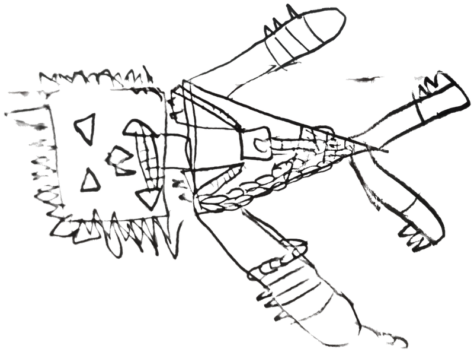
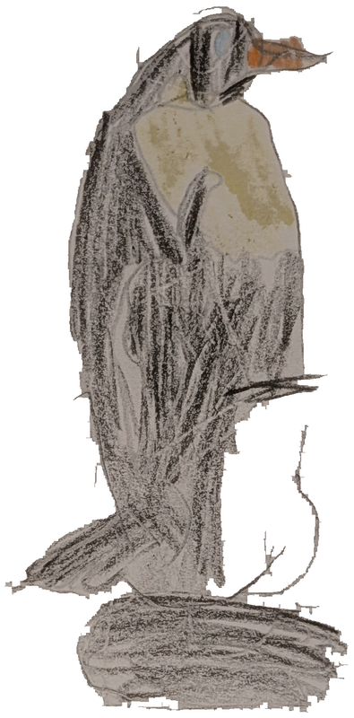

# Evan's Monster Rampage 🦖🐧

A Rampage-style city-smashing game starring two giant monsters **drawn by Evan**:

| SPIKY (Player 1) | PENGUIN (Player 2) |
|:---:|:---:|
|  |  |

Smash every building to win! The army sends tanks and helicopters to stop you —
punch them for bonus points. If they knock you dizzy, shake it off for a few
seconds and you're back at full strength.

## How to play

| | Player 1 — SPIKY | Player 2 — PENGUIN |
|---|---|---|
| Move | A / D | ← / → |
| Jump | W | ↑ |
| Punch | F | L |

- Works solo too: only the monster whose keys you press wakes up.
- **Punch buildings**: +10 per chunk, +100 when a building collapses.
- **Punch tanks & helicopters**: +50 (jump to reach the helicopters!).
- **Ground pound**: jump and land on something for a smash.

## Play in the browser

Every push builds a web version with GitHub Actions and deploys it to GitHub
Pages (see `.github/workflows/build.yml`). Once Pages is enabled for this
repository the game is playable at the repository's Pages URL.

## Run in the Godot editor

1. Install [Godot 4.3+](https://godotengine.org/download) (the free, small one — no login needed).
2. Open Godot, click **Import**, and pick this folder's `project.godot`.
3. Press **F5** (or the ▶ button) to play.

Everything is plain GDScript in `scripts/` — great for tweaking numbers with
your co-designer (monster speed, scores, building sizes are all constants at
the top of each file).

## How the sprites were made

The original drawings were photographed, then `tools/extract_sprites.py`
removes the paper background (local-contrast keying + despeckling) and saves
transparent PNGs into `art/`. The photos live in `art/originals/`. Sound
effects are synthesized by `tools/make_sfx.py` into `audio/`.
